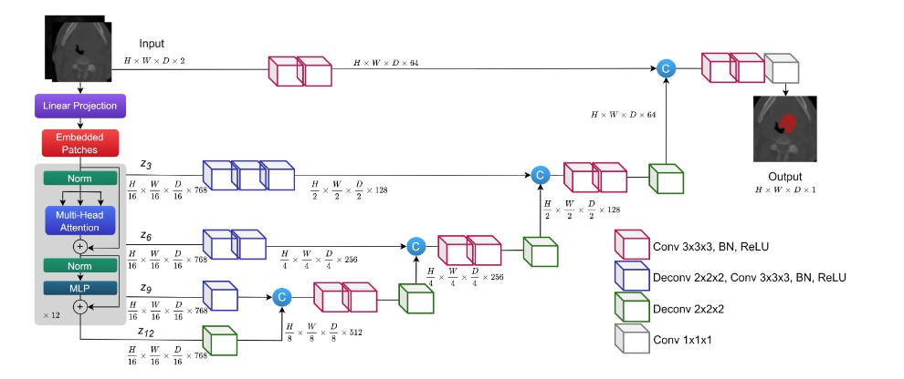
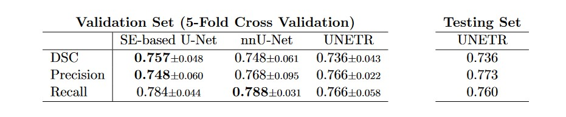
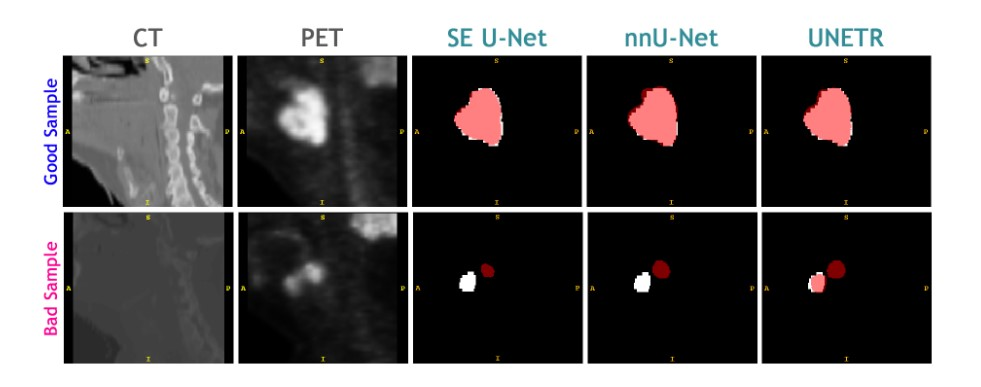

# Automatic Segmentation of Head and Neck Tumor: How Powerful Transformers Are?
[Paper](https://arxiv.org/abs/2201.06251)

Code for the paper studying performance of three different models (nnU-Net, Squeeze-and-Excitation U-Net, and UNETR) on the task of head and neck tumor segmentation. 


### Architecture

<p align="center">
  
</p>


### Main requirements
- PyTorch 1.11.0 (cuda 10.2)
- SimpleITK 2.1.1
- nibabel 3.2.2
- skimage 0.19.2


### Training the models
```
model_trainers/train_transformer.py -p [path_to_config]
```

### Validation and Testing Results
<p align="center">
  
</p>


### Dataset
Train and test images are available through the competition [website](https://www.aicrowd.com/challenges/miccai-2020-hecktor).


### Qualitative Results
<p align="center">
  
</p>


### Paper
If you use this code in you research, please cite the following paper ([arXiv](https://arxiv.org/abs/2201.06251)):
> Sobirov I., Nazarov O., Alasmawi H., Numan Saeed (2022) Automatic Segmentation of Head and Neck Tumor: How Powerful Transformers Are?

### References
[Original implementation of Squeeze-and-Excitation U-Net](https://github.com/iantsen/hecktor)
